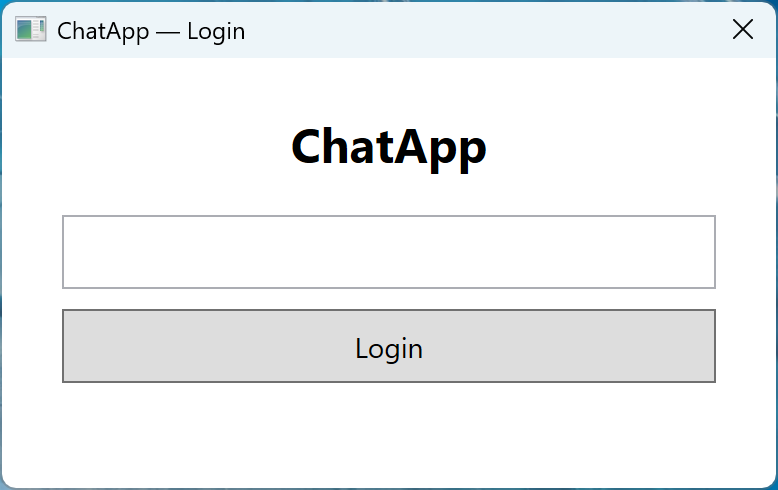
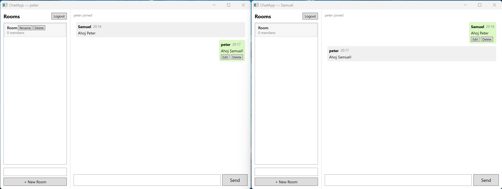

# Projekt BYROO - ChatApp

Jednoduchá chatovacia aplikácia s real-time komunikáciou. Server bežiaci na ASP.NET spracováva REST požiadavky a WebSocket spojenia cez SignalR, WPF klient slúži ako desktopové rozhranie a MySQL databáza uchováva používateľov, miestnosti a históriu správ.

Celá aplikácia funguje lokálne - klient aj server bežia na tom istom stroji (alebo v rámci lokálnej siete), žiadny externý hosting nie je potrebný.

**Funkcie:**
- Prihlásenie podľa username (bez hesla), odhlásenie (Logout) späť na login obrazovku
- Vytváranie miestností, real-time posielanie správ
- Úprava a mazanie vlastnej správy (mazanie je soft-delete - správa sa nahradí textom `[message deleted]`, história ostáva)
- Premenovanie a mazanie miestnosti - iba jej tvorca (kto miestnosť vytvoril)
- Zmeny (úprava správy, premenovanie/zmazanie miestnosti) sa naživo prejavia u všetkých pripojených klientov cez SignalR, netreba obnovovať

### Ukážky

**Prihlasovacia obrazovka:**



**Real-time chat medzi dvoma klientmi** - vlastné správy (zelené, vpravo) majú tlačidlá Edit/Delete, miestnosť má Rename/Delete tlačidlá viditeľné len pre jej tvorcu:



---

### Obsah
1. [Technologický stack](#1-technologický-stack)
2. [Štruktúra projektu](#2-štruktúra-projektu)
3. [Ako to spustiť](#3-ako-to-spustiť)
4. [Správa aplikácie](#4-správa-aplikácie)
5. [REST API endpointy](#5-rest-api-endpointy)
6. [SignalR Hub](#6-signalr-hub)
7. [Databáza](#7-databáza)
8. [Rozhodnutia pri riešení](#8-rozhodnutia-pri-riešení)

---

## 1. Technologický stack

| Vrstva | Technológia |
|---|---|
| Server | ASP.NET (minimálne API + controllery) |
| Real-time | SignalR (WebSocket) |
| Klient | WPF (.NET) |
| Databáza | MySQL + Entity Framework Core |
| Logovanie | Serilog |
| MVVM toolkit | CommunityToolkit.Mvvm |

---

## 2. Štruktúra projektu

Riešenie je rozdelené do štyroch projektov, aby bola jasná hranica medzi serverom, klientom, dátovou vrstvou a zdieľanými modelmi.

```
src/
├── ChatApp.Server/          # ASP.NET server - REST API + SignalR hub
│   ├── Controllers/
│   │   ├── AuthController.cs
│   │   ├── RoomsController.cs
│   │   └── MessagesController.cs
│   ├── Hubs/
│   │   └── ChatHub.cs
│   └── Program.cs
│
├── ChatApp.Client/          # WPF desktopový klient
│   ├── Views/
│   │   ├── LoginView.xaml
│   │   └── MainView.xaml
│   ├── ViewModels/
│   │   ├── LoginViewModel.cs
│   │   └── MainViewModel.cs
│   ├── Services/
│   │   ├── IChatService.cs
│   │   └── ChatService.cs
│   └── Converters/
│
├── ChatApp.Data/            # EF Core DbContext, entity, migrácie
│   ├── Entities/
│   ├── Configurations/
│   └── Migrations/
│
└── ChatApp.Shared/          # DTO modely zdieľané medzi serverom a klientom
    └── DTOs/
```

---

## 3. Ako to spustiť

### Predpoklady

- .NET 10 SDK — [https://dotnet.microsoft.com/download](https://dotnet.microsoft.com/download)
- Entity Framework CLI — `dotnet tool install --global dotnet-ef`
- MySQL server (lokálne bežiaci, napr. XAMPP alebo samostatná inštalácia)
- Git
- Na macOS je navyše potrebný `make` (súčasť Xcode Command Line Tools)

Kompletný zoznam závislostí vrátane NuGet balíčkov je v súbore `requirements.txt`.

Skripty `manage.ps1` (Windows) aj `Makefile` (macOS) pri každom spustení automaticky skontrolujú, či sú všetky systémové nástroje nainštalované, a ak niečo chýba, vypíšu čo treba doinštalovať. Na overenie bez spúšťania aplikácie:

```powershell
# Windows
.\manage.ps1 check
```

```bash
# macOS
make check-deps
```

### Krok za krokom

**1. Vytvorenie databázy**

V MySQL si treba vytvoriť databázu a používateľa (alebo použiť root):

```sql
CREATE DATABASE chatapp;
CREATE USER 'chatapp'@'localhost' IDENTIFIED BY 'chatapp_dev';
GRANT ALL PRIVILEGES ON chatapp.* TO 'chatapp'@'localhost';
```

**2. Konfigurácia**

Citlivé údaje (connection string, URL servera) nie sú uložené priamo v kóde - načítajú sa z environment premenných. V koreňovom adresári je súbor `.env.example`, ktorý slúži ako šablóna.

Na **Windows** (PowerShell):

```powershell
Copy-Item .env.example .env
```

Na **macOS** (Terminal):

```bash
cp .env.example .env
```

Obsah `.env` potom upravte podľa vášho prostredia:

```
ConnectionStrings__DefaultConnection=Server=localhost;Database=chatapp;User=chatapp;Password=chatapp_dev
ServerUrl=http://localhost:5050
```

Súbor `.env` je v `.gitignore`, takže sa nedostane do repozitára.

Alternatívne môžete vytvoriť `src/ChatApp.Server/appsettings.Development.json` (tiež v `.gitignore`):

```json
{
  "Urls": "http://0.0.0.0:5050",
  "ConnectionStrings": {
    "DefaultConnection": "Server=localhost;Database=chatapp;User=chatapp;Password=chatapp_dev"
  }
}
```

**3. Migrácie**

```
dotnet ef database update --project src/ChatApp.Data --startup-project src/ChatApp.Server
```

Toto vytvorí všetky tabuľky (Users, Rooms, Messages, RoomMembers).

**4. Spustenie servera**

```
dotnet run --project src/ChatApp.Server
```

Server štartuje na porte, ktorý je nastavený v konfigurácii (štandardne `http://localhost:5050`).

**5. Spustenie klienta**

```
dotnet run --project src/ChatApp.Client
```

URL servera, na ktorý sa klient pripája, sa berie z environment premennej `ServerUrl`. Ak nie je nastavená, použije sa fallback `http://localhost:5050` z `appsettings.json`.

**6. Testovanie**

Pre vyskúšanie chatu medzi dvoma používateľmi stačí spustiť klienta dvakrát. Každý sa prihlási pod iným menom, obaja sa pripoja do rovnakej miestnosti a správy sa zobrazujú v reálnom čase.

---

## 4. Správa aplikácie

Pre zjednodušenie bežných operácií sú k dispozícii skripty, ktoré riadia celú aplikáciu jedným príkazom. Na macOS sa používa `Makefile`, na Windows `manage.ps1` (PowerShell skript).

### Windows (PowerShell)

| Príkaz | Čo robí |
|---|---|
| `.\manage.ps1 start` | Skompiluje a spustí server + klient |
| `.\manage.ps1 stop` | Zastaví oba procesy |
| `.\manage.ps1 restart` | Zastaví a znovu spustí |
| `.\manage.ps1 upgrade` | Zastaví, pullne nový kód, migrácie, spustí |
| `.\manage.ps1 migrate` | Spustí len databázové migrácie |
| `.\manage.ps1 build` | Skompiluje bez spustenia |
| `.\manage.ps1 clean` | Vyčistí build artefakty |

### macOS (Terminal)

| Príkaz | Čo robí |
|---|---|
| `make start` | Skompiluje a spustí server + klient |
| `make stop` | Zastaví oba procesy |
| `make restart` | Zastaví a znovu spustí |
| `make upgrade` | Zastaví, pullne nový kód, migrácie, spustí |
| `make migrate` | Spustí len databázové migrácie |
| `make build` | Skompiluje bez spustenia |
| `make clean` | Vyčistí build artefakty |

Oba skripty si pamätajú PID spustených procesov v priečinku `.pids/`, takže `stop` vie spoľahlivo zastaviť správne procesy.

---

## 5. REST API endpointy

Server poskytuje tri controllery pre základné operácie:

| Metóda | Endpoint | Popis |
|---|---|---|
| POST | `/api/auth/login` | Prihlásenie (alebo registrácia) podľa username |
| GET | `/api/rooms` | Zoznam všetkých miestností |
| POST | `/api/rooms?userId={guid}` | Vytvorenie novej miestnosti (volajúci sa stáva jej tvorcom) |
| PATCH | `/api/rooms/{id}?userId={guid}` | Premenovanie miestnosti - iba tvorca, inak `403`. Duplicitný názov vráti `409` |
| DELETE | `/api/rooms/{id}?userId={guid}` | Zmazanie miestnosti - iba tvorca, inak `403`. Kaskádovo zmaže aj jej správy a členstvá |
| GET | `/api/rooms/{roomId}/messages?page=1&pageSize=50` | Načítanie histórie správ (stránkovanie) |

Login funguje jednoducho - pošle sa username, ak používateľ s týmto menom neexistuje, vytvorí sa nový. Žiadne heslá, keďže cieľom bolo demonštrovať real-time chat, nie autentifikáciu. Z toho vyplýva aj to, že `userId` v query stringu je klientom poskytnutá hodnota, nie overená identita - kontroly vlastníctva (napr. "iba tvorca môže zmazať miestnosť") sú teda aplikačné pravidlo, nie bezpečnostná záruka.

---

## 6. SignalR Hub

WebSocket komunikácia prebieha cez `ChatHub` na endpoint `/chat`. Hub poskytuje tieto metódy:

- **JoinRoom(roomId, userId)** - pripojí sa do miestnosti (pridá sa aj do DB ak tam ešte nie je) a notifikuje ostatných
- **LeaveRoom(roomId, userId)** - odpojí sa z miestnosti
- **SendMessage(roomId, userId, content)** - odošle správu, uloží ju do databázy a broadcastne ju všetkým v miestnosti
- **EditMessage(roomId, messageId, userId, newContent)** - upraví obsah vlastnej správy (nastaví `IsEdited`/`EditedAt`) a broadcastne zmenu. Ak `userId` nie je autorom správy, metóda ticho nič neurobí (rovnaký štýl ako ostatné metódy hubu - žiadna chyba sa neposiela späť volajúcemu)
- **DeleteMessage(roomId, messageId, userId)** - zmaže vlastnú správu (soft-delete - obsah sa nahradí `"[message deleted]"`, nastaví sa `IsDeleted`/`DeletedAt`) a broadcastne zmenu. Rovnako ako pri edite, cudziu správu to ticho ignoruje

Klient dostáva tieto udalosti:
- `ReceiveMessage` - nová správa
- `MessageUpdated` - správa bola upravená alebo zmazaná (rovnaká udalosť pre oba prípady - klient si podľa `Id` nájde pôvodnú správu vo svojom zozname a nahradí ju aktuálnou verziou)
- `UserJoined` - niekto sa pripojil do miestnosti
- `UserLeft` - niekto odišiel
- `RoomRenamed` - miestnosť bola premenovaná (posiela REST `PATCH` endpoint, nie hub metóda)
- `RoomDeleted` - miestnosť bola zmazaná (posiela REST `DELETE` endpoint); klient, ktorý bol práve v tejto miestnosti, z nej automaticky odíde

Hub používa `IDbContextFactory<ChatDbContext>` namiesto priameho injectovania DbContextu, pretože SignalR huby majú transient lifecycle a DbContext je scoped - priame injektovanie by spôsobovalo problémy pri viacerých súčasných spojeniach.

---

## 7. Databáza

Databázový model obsahuje štyri entity:

- **User** - id, username, dátum vytvorenia
- **Room** - id, názov (unikátny, max 100 znakov), dátum vytvorenia, `CreatedByUserId` (tvorca miestnosti - nullable, keďže staršie miestnosti z čias pred touto funkciou tvorcu nemajú)
- **Message** - id, obsah (max 2000 znakov), odosielateľ, miestnosť, čas odoslania, `IsEdited`/`EditedAt` (úprava správy), `IsDeleted`/`DeletedAt` (soft-delete - zmazaná správa zostáva v DB s tombstone obsahom `"[message deleted]"`, nemaže sa fyzicky)
- **RoomMember** - väzobná tabuľka medzi používateľom a miestnosťou (M:N)

EF Core konfigurácie sú v `ChatApp.Data/Configurations/` a definujú indexy (napr. index na `SentAt` pre rýchle načítanie histórie) a vzťahy medzi entitami. Zmazanie miestnosti kaskádovo zmaže aj jej správy a členstvá (`OnDelete(DeleteBehavior.Cascade)`); zmazanie používateľa, ktorý je tvorcom nejakej miestnosti, nastaví `CreatedByUserId` na `null` namiesto zmazania miestnosti (`OnDelete(DeleteBehavior.SetNull)`).

---

## 8. Rozhodnutia pri riešení

**Prečo SignalR a nie čistý WebSocket?**
SignalR je nadstavba nad WebSocket, ktorá rieši reconnect, fallback na long-polling ak WebSocket nie je dostupný, a groupovanie spojení. Pre chat aplikáciu je to ideálne, lebo netreba manuálne riešiť odpájanie a opätovné pripájanie klientov.

**Prečo MVVM?**
WPF je na MVVM postavený - data binding, commands, notifikácie. Použil som CommunityToolkit.Mvvm, ktorý generuje boilerplate cez source generátory (atribúty ako `[ObservableProperty]` a `[RelayCommand]`), takže ViewModely sú prehľadné.

**Prečo oddelený Data projekt?**
Entity, DbContext a migrácie sú v samostatnom projekte `ChatApp.Data`, aby sa dátová vrstva dala prípadne použiť aj inde a nebola priamo zviazaná so serverom.

**Prečo Shared projekt?**
DTO modely (ako `MessageDto`, `RoomDto` atď.) používa aj server aj klient. Namiesto ich duplikovania sú v `ChatApp.Shared`, na ktorý majú oba projekty referenciu.

**Vizuálne rozlíšenie správ**
Vlastné správy sa zobrazujú so zeleným pozadím a zarovnané doprava, cudzie správy sú šedé a zarovnané doľava - podobne ako v bežných chatovacích aplikáciách.

**Prečo je vlastníctvo (kto môže upraviť/zmazať čo) len aplikačné pravidlo, nie bezpečnostná kontrola?**
Appka nemá autentifikáciu (login je len "get-or-create user by username"), takže `userId` posielaný z klienta je vždy len tvrdenie, nie overená identita. Kontroly ako "iba autor môže upraviť správu" alebo "iba tvorca môže zmazať miestnosť" preto slúžia na to, aby appka fungovala korektne pri bežnom používaní (nikto si omylom neupraví cudziu správu), nie ako ochrana proti niekomu, kto by si zámerne poslal cudzie `userId`. Skutočná autorizácia by vyžadovala pridať autentifikáciu (napr. JWT), čo presahuje rozsah tohto projektu.
